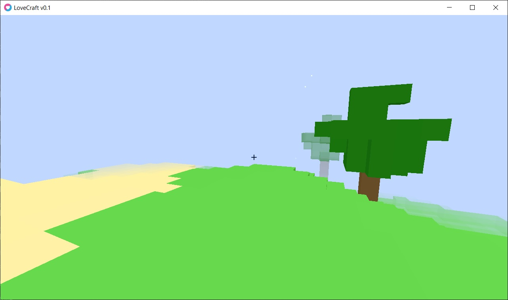

# LoveCraft – Voxel Sandbox in Lua/LÖVE2D  

A complete Minecraft-inspired game engine written in pure Lua using the LÖVE2D framework.  
Focused on terraforming, building, and performance.  

*Picture 1: Game screenshot*

## Features  
- **Procedural world** (512×64×512) with biomes: grass, desert, snow, forests, mountains  
- **Real-time terrain editing** – add/remove blocks (left/right click)  
- **Smooth first-person controller** with collision detection, gravity, and jumping  
- **Dynamic weather particles** – snow, falling leaves, flower petals, sandstorms  
- **World barrier** with glowing particle effects at world edges  
- **Adaptive render distance** (6–32 chunks) and FPS-based LOD  
- **Debug overlay** (F3) shows FPS, position, render stats, particle count  
- **In-game menu** with settings for render distance and wireframe mode  
- **Optimized CPU culling** – face culling, distance & frustum culling  

## How to Run  
1. Install [LÖVE2D](https://love2d.org/) (≥11.0)  
2. Save the code as `main.lua` (or `game.lua` + `main.lua` as in snippet)  
3. Run: `love .` in the folder  

## Controls  
- **WASD** – move  
- **Mouse** – look around  
- **Left click** – break block  
- **Right click** – place stone block  
- **Space** – jump  
- **F3** – debug overlay  
- **Esc** – menu  

## Technical Notes  
- Single-file consolidation (no external assets)  
- Vertex colors instead of textures  
- Particle systems adapt to biome and nearby trees  
- Garbage collection optimized for smooth gameplay  

## License  
MIT – free to use, modify, and distribute.